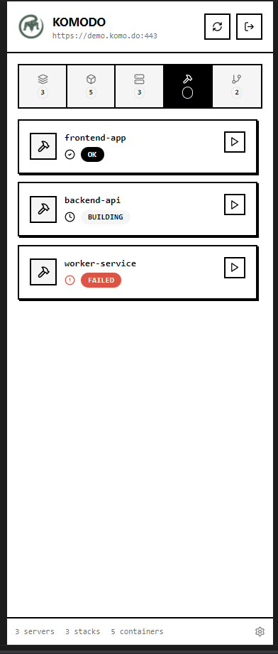
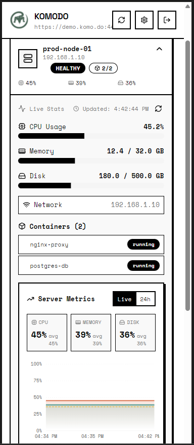
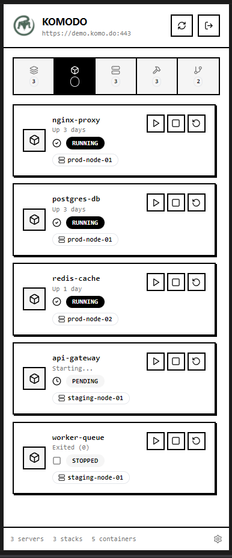
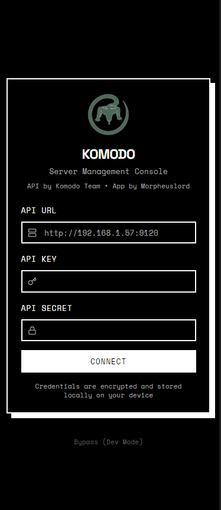
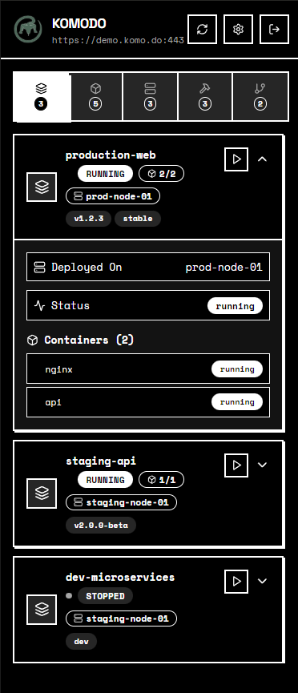
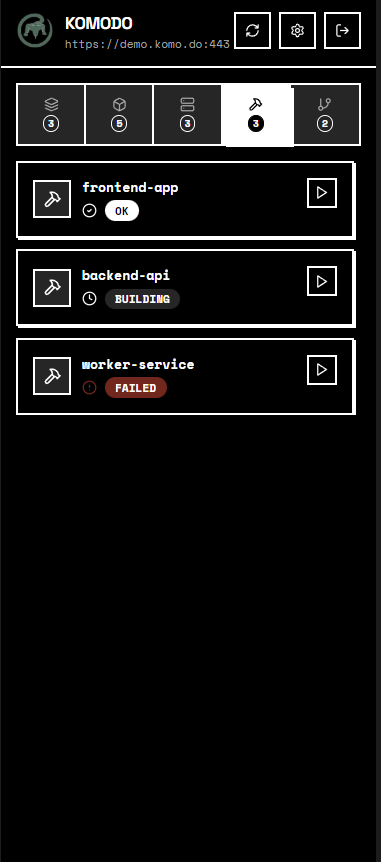
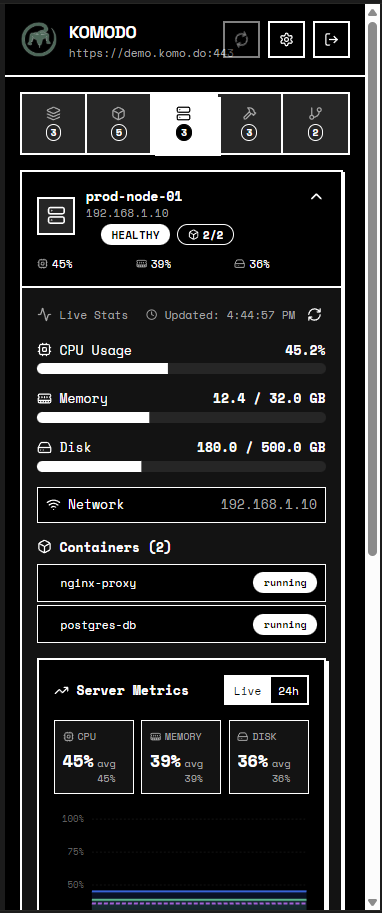
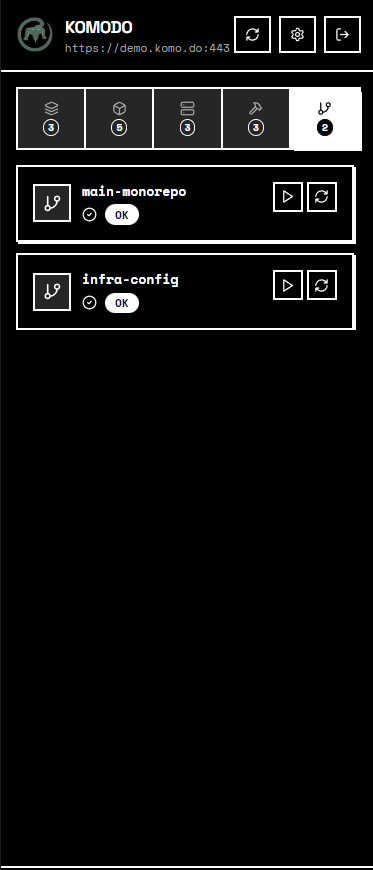
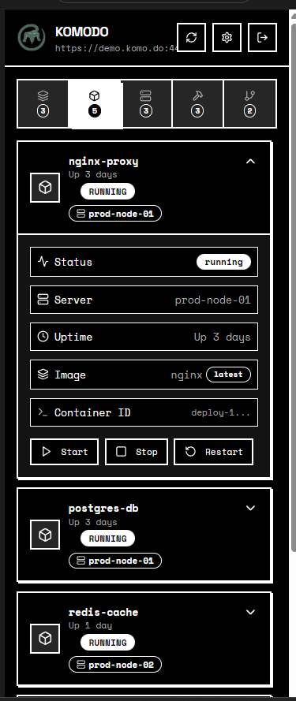

# Komodo Manager

A mobile-first server management console for [Komodo](https://komo.do) - monitor and control your servers, containers, stacks, builds, and repos from anywhere.

**API by Komodo Team • App by Chiranjeevi G (Morpheuslord)**

---

## Screenshots

<p align="center">
  
  
  
  
  
  
</p>

<p align="center">
  
  
  
  
  
  
</p>

---

## Features

### 🖥️ Server Monitoring
- **Real-time Resource Monitoring**: View live CPU, RAM, and disk usage with visual progress indicators
- **Network Statistics**: Monitor network ingress/egress traffic in real-time
- **Server Health Status**: Visual indicators for server state (running, stopped, error)
- **Container Overview**: See all containers running on each server at a glance
- **Bulk Server Actions**: Start, stop, restart, or prune all containers on a server

### 📦 Container Management
- **Container Lifecycle Control**: Start, stop, and restart individual containers
- **Detailed Container Information**: 
  - View container status, uptime, and server assignment
  - See container image details and tags
  - Monitor network ingress/egress statistics
  - Access container ID with one-click copy
- **Container Details Dialog**: Click on any container name to view comprehensive details
- **Exposed Ports Viewer**: 
  - View all exposed ports with host-to-container mappings
  - Copy port mappings to clipboard
  - Protocol information (TCP/UDP)
- **Container Logs Viewer**: 
  - View container logs with configurable line count (100, 500, 1000 lines)
  - Auto-scroll to latest logs
  - Download logs functionality
  - Support for both stdout and stderr streams
- **Container Status Tracking**: Real-time status updates with visual indicators
- **Network Statistics**: View network traffic per container

### 🗂️ Stack Management
- **Stack Deployment**: Deploy Docker stacks with a single click
- **Stack Status Monitoring**: Track stack health and container states
- **Container Integration**: View all containers belonging to a stack
- **Stack Details**: See stack tags, server assignment, and deployment status
- **Container Quick Access**: Click container names in stacks to view detailed information
- **Multi-Container Management**: Manage all containers in a stack from one view

### 🔨 Build Tracking
- **Build Status Monitoring**: Track build progress and completion status
- **Build Triggers**: Start new builds directly from the app
- **Build History**: View all builds and their current states
- **Visual Status Indicators**: Color-coded badges for build states (pending, building, success, failed)

### 🔗 Repository Integration
- **Repository Overview**: View all connected repositories
- **Repository Actions**: 
  - Clone repositories
  - Pull latest changes
- **Repository Status**: Monitor repository sync status

### 🎨 User Experience
- **Dark/Light Theme Support**: Switch between themes with system preference detection
- **Mobile-First Design**: Optimized for mobile devices with touch-friendly interfaces
- **Responsive Layout**: Works seamlessly on phones and tablets
- **Collapsible Panels**: Expandable sections for detailed information
- **Toast Notifications**: Real-time feedback for all actions
- **Loading States**: Visual indicators during API operations

### 📊 Data Visualization
- **Progress Bars**: Visual representation of CPU, memory, and disk usage
- **Status Badges**: Color-coded status indicators throughout the app
- **Statistics Charts**: 24-hour resource usage trends for servers
- **Network Traffic Display**: Formatted network statistics (KB, MB, GB)

### 🚀 Advanced Features
- **Auto-Refresh**: Automatic data refresh for real-time monitoring
- **Manual Refresh**: Pull-to-refresh functionality
- **Error Handling**: Graceful error messages with retry options
- **Offline Support**: Cached data display when connection is unavailable
- **Copy to Clipboard**: Quick copy functionality for IDs, ports, and other data

---

## Tech Stack

- **Frontend**: React 18, TypeScript, Vite
- **UI**: Tailwind CSS, shadcn/ui
- **Mobile**: Capacitor 8 (Android)
- **API Client**: komodo_client

---

## Development Setup

### Prerequisites

- Node.js 18+ and npm
- Git

### Install Dependencies

```bash
git clone <your-repo-url>
cd komodo-manager
npm install
```

### Run Development Server

```bash
npm run dev
```

The app will be available at `http://localhost:5173`

---

## Building for Android

### Prerequisites

- [Android Studio](https://developer.android.com/studio) (with SDK 24+)
- Java JDK 17+
- Android device or emulator

### Step-by-Step Build Process

#### 1. Install Dependencies

```bash
npm install
```

#### 2. Build the Web App

```bash
npm run build
```

#### 3. Add Android Platform (first time only)

```bash
npx cap add android
```

#### 4. Sync Web Assets to Android

```bash
npx cap sync android
```

> **Note**: Run `npx cap sync` every time you pull new changes or modify web code.

#### 5. Open in Android Studio

```bash
npx cap open android
```

#### 6. Build APK

In Android Studio:
1. Go to **Build → Build Bundle(s) / APK(s) → Build APK(s)**
2. Wait for the build to complete
3. Click **locate** to find the APK

Or from command line:

```bash
cd android
./gradlew assembleRelease
```

The APK will be at: `android/app/build/outputs/apk/release/app-release.apk`

#### 7. Run on Device/Emulator

```bash
npx cap run android
```

---

## Configuration

### Capacitor Config

Edit `capacitor.config.json` to modify app settings:

```json
{
  "appId": "com.komodo.app",
  "appName": "Komodo Manager",
  "webDir": "dist"
}
```

### Development with Live Reload

For testing on a physical device with live reload, update `capacitor.config.json`:

```json
{
  "server": {
    "url": "http://YOUR_LOCAL_IP:5173",
    "cleartext": true
  }
}
```

> **Important**: Remove the `server` block before building for production.

---

## Usage Guide

### Connecting to Komodo API

1. Launch the app
2. Enter your Komodo server URL (e.g., `https://demo.komo.do:443` or `http://192.168.1.57:9120`)
3. Enter your API Key and API Secret
4. Tap **Connect**

Credentials are encrypted and stored locally on your device.

### Managing Servers

1. Navigate to the **Servers** tab
2. Tap on any server card to expand and view details
3. View real-time CPU, memory, and disk usage
4. See all containers running on the server
5. Use action buttons to:
   - Start/Stop/Restart all containers
   - Prune system resources
   - Refresh server statistics

### Managing Containers

1. Navigate to the **Containers** tab to see all containers
2. Or view containers within a specific server in the **Servers** tab
3. Tap on a container card to expand and see:
   - Container status and uptime
   - Server assignment
   - Image information
   - Network statistics
4. Use management options:
   - **Ports**: View exposed ports with server IP addresses
   - **Logs**: View container logs (configurable line count)
5. Use action buttons to Start, Stop, or Restart containers
6. Click on container names in stacks to open detailed information dialogs

### Managing Stacks

1. Navigate to the **Stacks** tab
2. View all deployed stacks with their status
3. Tap on a stack to see:
   - All containers in the stack
   - Stack tags and metadata
   - Server assignment
4. Click container names to view detailed information
5. Use the **Deploy** button to deploy or update stacks

### Viewing Container Ports

1. Open any container (from Containers tab, Servers tab, or Stacks)
2. Click the **Ports** button in the Management Options section
3. View all exposed ports with:
   - Host port mappings
   - Container ports
   - Protocol information (TCP/UDP)
4. Click the copy icon to copy port mappings to clipboard

### Viewing Container Logs

1. Open any container
2. Click the **Logs** button in the Management Options section
3. Select log line count (100, 500, or 1000 lines)
4. View logs with auto-scroll to latest entries
5. Use the download button to save logs
6. Toggle auto-scroll on/off as needed

### Managing Builds

1. Navigate to the **Builds** tab
2. View all builds with their current status
3. Use the **Build** button to trigger new builds
4. Monitor build progress in real-time

### Managing Repositories

1. Navigate to the **Repos** tab
2. View all connected repositories
3. Use **Clone** to clone a repository
4. Use **Pull** to sync latest changes

### Theme Customization

1. Tap the settings icon in the top-right corner
2. Toggle between **Light** and **Dark** themes
3. Theme preference is saved automatically

---

## Project Structure

```
├── src/
│   ├── components/     # UI components
│   ├── contexts/       # React contexts (Auth)
│   ├── hooks/          # Custom hooks
│   ├── lib/            # API client, utilities
│   ├── pages/          # App screens
│   └── assets/         # Images, logos
├── android/            # Android native project
├── public/             # Static assets
└── capacitor.config.json
```

---

## Troubleshooting

### App crashes on Android

- Ensure `npx cap sync` was run after the latest build
- Check Android Studio Logcat for errors

### API connection fails

- Verify the server URL includes protocol and port
- For HTTP (non-HTTPS), ensure `cleartext` is enabled in Capacitor config
- Check that your device can reach the server network

### Build errors

```bash
# Clean and rebuild
cd android
./gradlew clean
cd ..
npm run build
npx cap sync android
```

---

## License

MIT License - see LICENSE file for details.

---

## Credits

- **Komodo API**: [Komodo Team](https://komo.do)
- **App Development**: [Chiranjeevi G (Morpheuslord)](https://github.com/morpheuslord)
