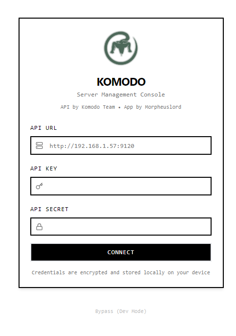
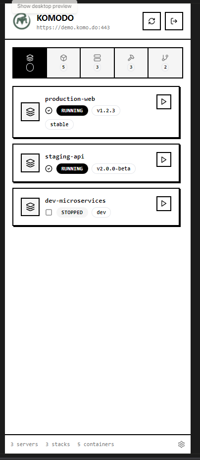
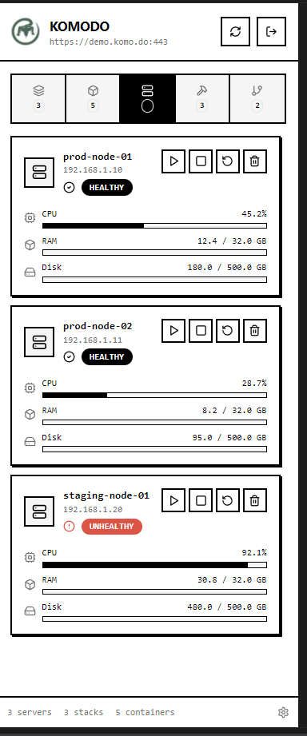
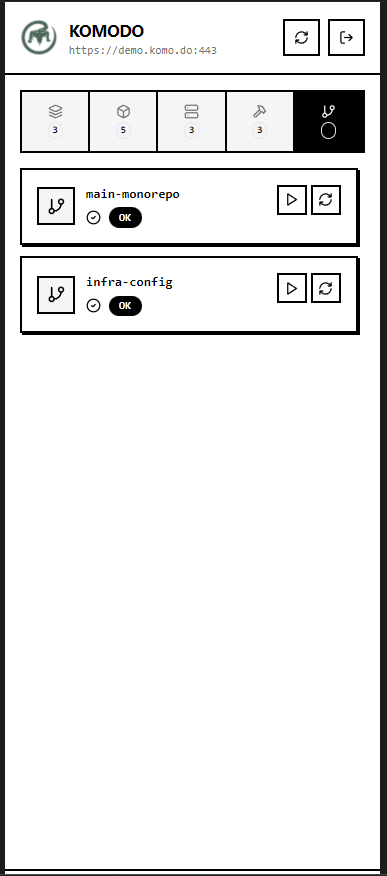

# Komodo Manager

A mobile-first server management console for [Komodo](https://komo.do) - monitor and control your servers, containers, stacks, builds, and repos from anywhere.

**API by Komodo Team • App by Chiranjeevi G (Morpheuslord)**

---

## Screenshots

<p align="center">
  
  
  
</p>

<p align="center">
  
  
  
</p>

---

## Features

- 🖥️ **Server Monitoring** - View CPU, RAM, and disk usage in real-time
- 📦 **Container Management** - Start, stop, and restart containers
- 🗂️ **Stack Management** - Deploy and manage Docker stacks
- 🔨 **Build Tracking** - Monitor build status and trigger new builds
- 🔗 **Repo Integration** - View and sync connected repositories
- 🔐 **Secure Authentication** - Encrypted credential storage on device
- 📱 **Mobile-First Design** - Built for Android with Capacitor

---

## Tech Stack

- **Frontend**: React 18, TypeScript, Vite
- **UI**: Tailwind CSS, shadcn/ui
- **Mobile**: Capacitor 8 (Android)
- **API Client**: komodo_client

---

## Development Setup

### Prerequisites

- Node.js 18+ and npm
- Git

### Install Dependencies

```bash
git clone <your-repo-url>
cd komodo-manager
npm install
```

### Run Development Server

```bash
npm run dev
```

The app will be available at `http://localhost:5173`

---

## Building for Android

### Prerequisites

- [Android Studio](https://developer.android.com/studio) (with SDK 24+)
- Java JDK 17+
- Android device or emulator

### Step-by-Step Build Process

#### 1. Install Dependencies

```bash
npm install
```

#### 2. Build the Web App

```bash
npm run build
```

#### 3. Add Android Platform (first time only)

```bash
npx cap add android
```

#### 4. Sync Web Assets to Android

```bash
npx cap sync android
```

> **Note**: Run `npx cap sync` every time you pull new changes or modify web code.

#### 5. Open in Android Studio

```bash
npx cap open android
```

#### 6. Build APK

In Android Studio:
1. Go to **Build → Build Bundle(s) / APK(s) → Build APK(s)**
2. Wait for the build to complete
3. Click **locate** to find the APK

Or from command line:

```bash
cd android
./gradlew assembleRelease
```

The APK will be at: `android/app/build/outputs/apk/release/app-release.apk`

#### 7. Run on Device/Emulator

```bash
npx cap run android
```

---

## Configuration

### Capacitor Config

Edit `capacitor.config.json` to modify app settings:

```json
{
  "appId": "com.komodo.app",
  "appName": "Komodo Manager",
  "webDir": "dist"
}
```

### Development with Live Reload

For testing on a physical device with live reload, update `capacitor.config.json`:

```json
{
  "server": {
    "url": "http://YOUR_LOCAL_IP:5173",
    "cleartext": true
  }
}
```

> **Important**: Remove the `server` block before building for production.

---

## Connecting to Komodo API

1. Launch the app
2. Enter your Komodo server URL (e.g., `https://demo.komo.do:443`)
3. Enter your API Key and API Secret
4. Tap **Connect**

Credentials are encrypted and stored locally on your device.

---

## Project Structure

```
├── src/
│   ├── components/     # UI components
│   ├── contexts/       # React contexts (Auth)
│   ├── hooks/          # Custom hooks
│   ├── lib/            # API client, utilities
│   ├── pages/          # App screens
│   └── assets/         # Images, logos
├── android/            # Android native project
├── public/             # Static assets
└── capacitor.config.json
```

---

## Troubleshooting

### App crashes on Android

- Ensure `npx cap sync` was run after the latest build
- Check Android Studio Logcat for errors

### API connection fails

- Verify the server URL includes protocol and port
- For HTTP (non-HTTPS), ensure `cleartext` is enabled in Capacitor config
- Check that your device can reach the server network

### Build errors

```bash
# Clean and rebuild
cd android
./gradlew clean
cd ..
npm run build
npx cap sync android
```

---

## License

MIT License - see LICENSE file for details.

---

## Credits

- **Komodo API**: [Komodo Team](https://komo.do)
- **App Development**: [Chiranjeevi G (Morpheuslord)](https://github.com/morpheuslord)
